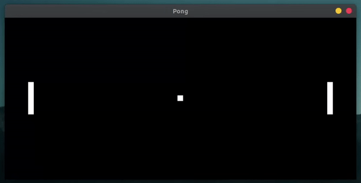
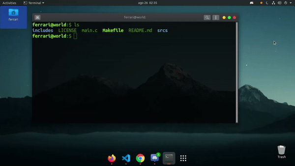

  

# PONG  

Pong is a two-dimensional sports game that simulates table tennis. The player controls an in-game paddle by moving it vertically across the left or right side of the screen. They can compete against another player controlling a second paddle on the opposing side. Players use the paddles to hit a ball back and forth. The goal is for each player to reach eleven points before the opponent; points are earned when one fails to return the ball to the other. 

## HOW TO INSTALL  

First we need install SDL library on our system. This can be done as follow below.  
```sh
sudo apt-get install libsdl2-2.0 && sudo apt-get install libsdl2-dev
```  
Now you can clone this repository on your computer.
```sh
git clone http://github.com/LuigiEnzoFerrari/PONG
```  
Now we have all you need to play the game.

## Run the game  

Go inside the repository thought your terminal and write the command bellow to start the game.  

```sh
make run
```  

  

### KeyBoard  

PLAYER 1  
* w : go up  
* s : go down  

PLAYER 2  
* up_arrow: go up  
* down_arrow: go down  

GAME STATS  
* backspace: unfroze the game  
* esc: exit the game and close the window  
### About the game

1. The game will start fronzen when you start it or when one of the players lost the round.  

2. When the ball hit the player its velocity will increasis randonly from the initial velocity in a range of 1~3x.  
3. When one of the players lost the round all objects position will be reset to the initial positions of the game.  
